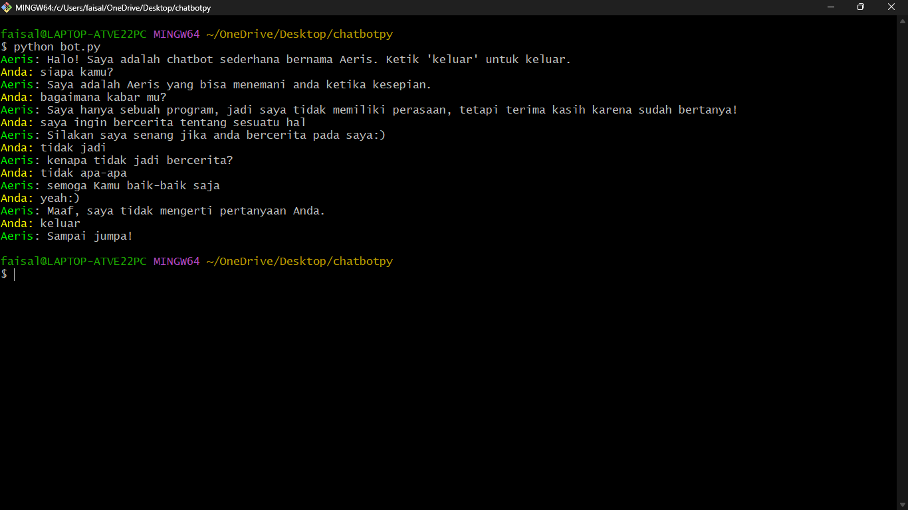

# Assistant GPT-3.5 - A Simple Chatbot in Python



**Assistant GPT-3.5** is a simple chatbot built using Python that can interact with users through the terminal. The chatbot provides responses to various user inputs and can engage in basic conversation. It uses a dictionary-based response system to generate replies.

## 🚀 Getting Started

To get a copy of this chatbot up and running on your local machine, follow these steps:

### Prerequisites

- Python 3.x
- Terminal (Command Prompt or PowerShell on Windows)

### Installation

1. Clone the repository:

```bash
git clone https://github.com/FaisalArdhani/chatbotpy.git
cd chatbotpy
```

2. Run the chatbot:

```bash
python bot.py
```

## 💬 How to Use

- Upon running the chatbot, you'll see a colored chat prompt with the name "Assistant GPT-3.5".
- Type your messages to interact with the chatbot. Try saying "hello", "what's your name?", "how are you?", or "exit" to quit the conversation.
- The chatbot will respond to your messages with pre-defined responses.

## 🎨 Customization

You can easily customize the chatbot responses or add more responses by modifying the `chatbot_response` function in the script.

```python
def chatbot_response(user_input):
    # Custom responses go here
    responses = {
        "custom input": "Custom output",
        # Add more custom responses as needed
    }
    return responses.get(user_input.lower(), "Sorry, I don't understand your question.")
```

## 🌈 Colorful Chat

The chat messages have different colors to make the conversation more fun and visually appealing. The `colored_print` function in the script is responsible for applying colors to the chat messages.

```python
def colored_print(text, color):
    colors = {
        'red': '\033[91m',
        'green': '\033[92m',
        'yellow': '\033[93m',
        'blue': '\033[94m',
        'magenta': '\033[95m',
        'cyan': '\033[96m',
        'white': '\033[97m',
        'reset': '\033[0m'
    }
    return f"{colors[color]}{text}{colors['reset']}"
```

Feel free to modify the colors or add more colors to suit your taste!

## 🤖 About Assistant GPT-3.5

Assistant GPT-3.5 is a simple chatbot built using Python. It's an educational project designed to demonstrate basic chatbot functionality. The chatbot uses a predefined set of responses to interact with users. You can easily modify or expand its capabilities to create your own personalized chatbot.

## 📝 License

This project is licensed under the MIT License - see the [LICENSE](LICENSE) file for details.

---
Created with ❤️ by [Faisal Ardhani](https://github.com/FaisalArdhani)
```

In the README, I've provided sections on "Getting Started," "How to Use," "Customization," "Colorful Chat," and an "About Assistant GPT-3.5" section. Additionally, there's a license section, and I've included a footer with the creator's name and GitHub profile link. Feel free to modify this template further to suit your preferences and the project's needs. Happy coding!
Enjoy chatting with Assistant GPT-3.5! 🤖✨
